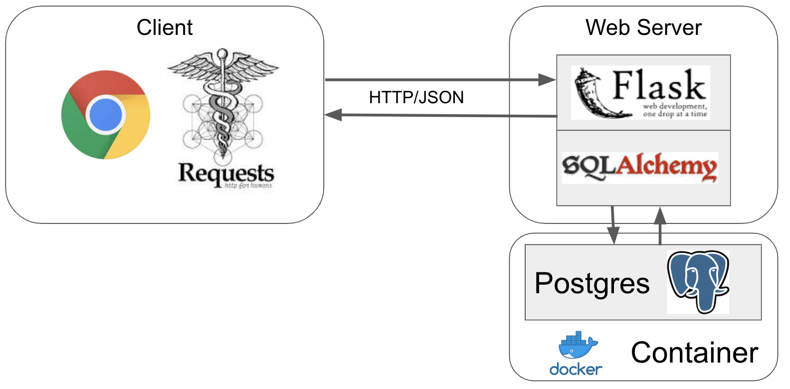

# Deployement

1. [Flask](https://github.com/becodeorg/ai-track/tree/master/Content/Hill/Deployement/Flask)
1. [Docker](https://github.com/becodeorg/ai-track/tree/master/Content/Hill/Deployement/Docker)
1. [Database](https://github.com/becodeorg/ai-track/tree/master/Content/Hill/Deployement/Database)
1. [Web Application](https://github.com/becodeorg/ai-track/tree/master/Content/Hill/Deployement/Web_application)

In this course we are gonna show you how to deploy properly your application ofr the public using Docker, Flask, different types of Database as well as Web Services.

**Note : Check out your GitHub Student Developer Pack for free credits on Web Services and Databases (Azure, AWS, Heroku, MongoDB Atlas. But be careful to use it wisely.** 

