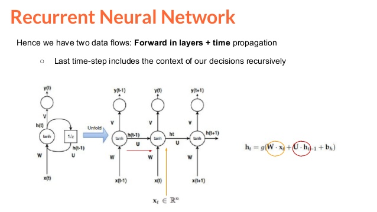
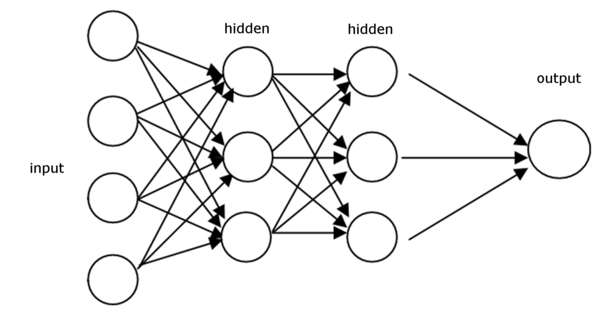
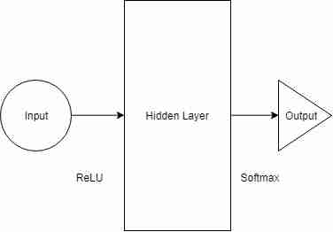
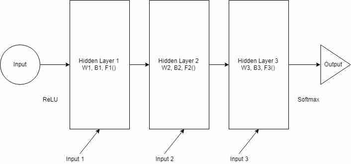
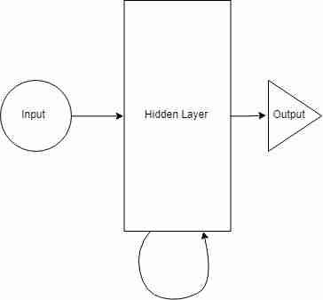
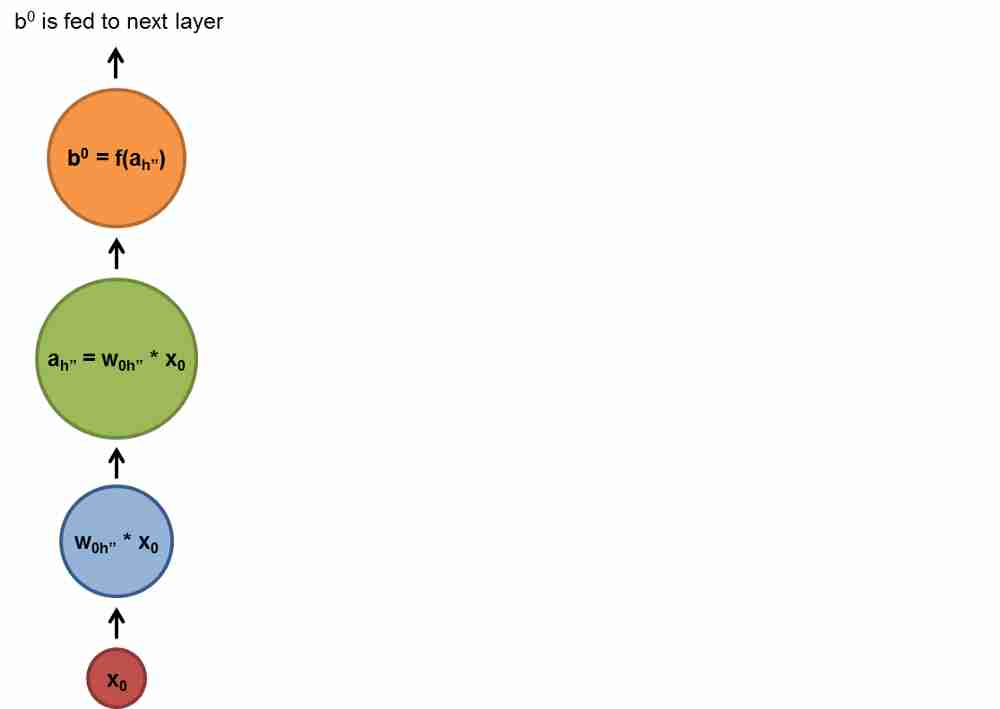
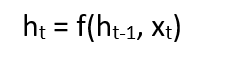
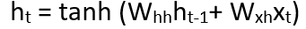
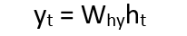
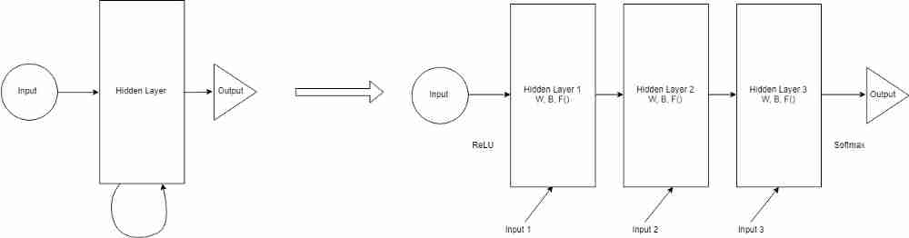

# Recurrent neural network
What is a Recurrent Neural Network or RNN, how it works, where it can be used? This course tries to answer the above questions. It also shows a demo implementation of a RNN used for a specific purpose, but you would be able to generalise it for your needs.

## Why do we need RNN?
You might be wondering by now, we have networks like Convolutional ones which perform very well. Why do we need another type of a network? There is a very specific use case where RNNs are required. In order to explain RNNs you need to first understand something called a sequence. Let's talk about sequences first.

### What is the sequence ?
Sequence is a stream of data (finite or infinite) which are interdependent. Examples would be time series data, informative pieces of strings, conversations etc. In a conversation a sentence means something but the entire flow of the conversation mostly means something completely different. Also in a time series data like stock market data, a single tick data means the current price, but a full days data will show movement and allow us to take decision whether to buy or sell.

### In what context can I use RNNs?

RNNs can be used in a lot of different places. Following are a few examples where a lot of RNNs are used.

1. Language Modelling and Generating Text
Given a sequence of word, here we try to predict the likelihood of the next word. This is useful for translation since the most likely sentence would be the one that is correct.

2. Machine Translation
Translating text from one language to other uses one or the other form of RNN. All practical day systems use some advanced version of a RNN.

3. Speech Recognition
Predicting phonetic segments based on input sound waves, thus formulating a word.

4. Generating Image Descriptions
A very big use case is to understand what is happening inside an image, thus we have a good description. This works in a combination of CNN and RNN. CNN does the segmentation and RNN then used the segmented data to recreate the description. It’s rudimentary but the possibilities are limitless.

5. Video Tagging
This can be used for video search where we do image description of a video frame by frame.

Lets Dig Deep!
We will be following the below mentioned sequence of topics to finish the document. Each section builds on top of another so don’t read this as a reference.

1. Feed-forward Networks
2. Recurrent Networks
3. Recurrent Neuron
4. Backpropagation Through Time (BPTT)
5. RNN Implementation

CNNs generally do not work well when input data are interdependent in a sequential model. The CNNs have no correlation between the previous and the next input. All outputs are therefore dependent. CNN takes an input and output based on the formed model. If you execute 100 different inputs, none of them will be biased by the previous output. But let's imagine a scenario like sentence generation or text translation. All generated words depend on the words generated before (in some cases, it also depends on the following words, but we will discuss this later). You must therefore have a bias based on your previous production. This is where the RNNs shine. The RNNs have some sort of memory of what happened earlier in the data sequence. This helps the system to gain context. Theoretically, RNNs have infinite memory, which means they have the ability to look back indefinitely. Looking back, I mean all the previous entries. But in practice, they can only go back to the last few steps.

### Feed-forward Networks Primer
Feed-forward networks channel information through a series of operations which take place in each node of the network. Feed-forward networks pass the information directly through each layer exactly once. This is different from other recurrent networks. We will talk about them in a later section. Generally feed-forward nets take an input and produce an output from it. This is also mostly a supervised learning step and the outcome most likely will be a classification. It behaves similarly to how a CNN behaves. Outputs can be expected to be classes like cats or dogs as labels.

A feed forward network is trained on a set of pre labelled data. The objective of the training phase is to reduce the error while the feed-forward network tries to guess the class. Once training is done, the weights are used to classify new batches of data.

A typical feed-forward network architecture
One important thing to note here. In a feed forward network whatever image is shown to the classifier during test phase, it doesn’t alter the weights so the second decision is not affected. This is one very important difference between feed-forward networks and recurrent nets.

> Feed-forward nets don’t remember historic input data at test time unlike recurrent networks.

It’s always point in time decision. They only remember things that were shown to them during the training phase.

### Recurrent Networks  

Recurrent networks, on the other hand, take as their input not just the current input example they see, but also what they have perceived previously in time.

Let’s try to build a multi layer perceptron to start with the explanation. In simple terms there is a input layer, a hidden layer with certain activations and finally we receive an output.

A sample multi layer perceptron architecture  

If we increase the number of layers in the above example, input layer takes the input. Then the first hidden layer does the activcation passing onto the next hidden layers and so on. Finally it reaches the output layer which gives the output. Each hidden layer has its own weights and biases. Now the question is can we input to the hidden layers.

Each layer has its own weight (W), biases (B), Activation Functions (F). These layers behave differently and technically would be challenging to merge together. To be able to merge them, lets replace all the layers with the same wegiths and bioases. It will look sometjhing like this.

Now we can merge all the layers together. All the hidden layers can be combinesd into a single recurrent layer. So they start looking somewhat like this:

We will provide input to the hidden layer at each step. A recurrent neuron now stores all the previous step input and merges that information with the current step input. Thus it also captures some information regarding the correlation between current data step and the previous steps. The decision at a time step t-1 affects the decision taken at time t. This is very much like how we as humans take decisions in our life. We combine the present data with recent past to take a call on a particular problem at hand. This example is excessively rudimentary but in principle it aligns with our decision making capability. This really intrigues me as to whether we as humans are intelligent or we have a very advanced neural network model. Our decisions are just the training data that we have been collecting throughout our life. Thus can we digitise our brains once we have a fairly advanced model and systems capable of storing and computing them in reasonable time periods. *So what happens when we have models better and faster than our brains training on data from millions of people?*

> Funny anecdote from another [article](https://skymind.ai/wiki/lstm): a person is haunted by their deeds

Let’s come back to the problem at hand and rephrase the above explanation with an example to predict what the next letter is after a sequence of letters. Imagine in the word namaskar. The word is of 8 letters.

> **namaskar:** a traditional Indian greeting or gesture of respect, made by bringing the palms together before the face or chest and bowing.

If we were trying to figure out the 8th letter after 7 letters were fed to the network, what would have happened. The hidden layer would have gone through 8 iterations. If we were to unfold the network, it would be a 8 layer network, one layer for each letter. So you can imagine that a normal neural network is repeated multiple times. The number of times you unroll has a direct correlation with how far in the past it can remember. But more on this later.

how recurrent neural networks work #deeplearning4j #dl4j

### Recurrent Neuron
Here we will look in more depth regarding the actual neuron that is responsible for the decision making. We will be using the namaskar example described above. We will try to figure out the 8th letter given all the previous 7 letters. Total vocabulary of the input data is {n,a,m,s,k,r}. In real world you will have more complex words or sentences. For simplicity we will use this simple vocabulary.

In the above diagram, the hidden layer or the RNN block applies a formula to the current input as well as the previous state. In this case the letter n from namaste has nothing preceeding it, so we will move on to the next letter which is a. During the time of letter a and the previous state which was letter n the formula is applied by the hidden layer. We will go through the formula in a bit. Each state when an input passes the network is a time step or a step. So if at time t, the input is a, then at time t-1, the input is n. After applying the formula to both n and a, we get a new state.

The formula for the current state can be written like this:

ht is the new state and ht-1 is the previous state. xt is the input at time t. We now have a sense of the previous inputs after it has gone through the same formula from the previous time steps. We will go through 7 such inputs to the network which passes by the same weights and same function at each step.

Now let’s try to define f() in a simple fashion. We will take tanh as the activation function. The weights are defined by the matrix Whh and the input is defined by the matrix Wxh. So the formula looks like:

The above example takes only the last step as memory and thus merging with the data of last step. To increase the memory capacity of the network, and hold longer sequences in memory, we have to add more states to the equation, like ht-2, ht-3 etc. Finally the output can be calculated as during test time:

where yt is the output. The output is compared to the actual output and then an error value is computed. The network learns by back propagating the error via the network to update the weights. We will talk about backpropagation in the next section.

### Backpropagation Through Time (BPTT)
This section considers that you are aware of Backpropagation as a concept. If you need to understand Backpropagation then please visit this link to read more.

So now we understand how a RNN actually works, but how does the training actually work? How do we decide the weights for each connection? And how do we initialise these weights for these hidden units. The purpose of recurrent nets is to accurately classify sequential input. We rely on the backpropagation of error and gradient descent to do so. But a standard backpropagation like how used in feed forward networks can’t be used here.

The problem with RNNs is that they are cyclic graphs unlike feed-forward networks which are acyclic directional graphs. In feed-forward networks we could calculate the error derivatives from the layer above. In a RNN we don’t have such layering.

The answer lies in what we had discussed above. We need to unroll the network. We will unroll it and make it look like a feed-forward network.

Unrolling a RNN  

We take a RNN’s hidden units and replicate it for every time step. Each replication through time step is like a layer in a feed-forward network. Each time step t layer connects to all possible layers in the time step t+1. Thus we randomly initialise the weights, unroll the network and then use backpropagation to optimise the weights in the hidden layer. Initialisation is done by passing parameters to the lowest layer. These parameters are also optimised as a part of backpropagation.

An outcome of the unrolling is that each layer now starts maintaining different weights and thus end up getting optimised differently. The errors calculated w.r.t the weights are not guaranteed to be equal. So each layer can have different weights at the end of a single run. We definitely don’t want that to happen. The easy solution out is to aggregate the errors across all the layers in some fashion. We can average out the errors or even sum them up. This way we can have a single layer in all time steps to maintain the same weights.

### RNN Implementation with Keras

This repository contains iPython notebooks that demonstrate how to use the Keras library to build Recurrent Neural Network models for natural language processing tasks. There are three tasks and accompanying datasets: sentiment (review rating) prediction, language modeling (applied to text generation), and part-of-speech tagging. Each notebook is intended to stand alone as a demonstration, but there is a lot of redundancy between them in the code and documentation. These notebooks are probably most useful to people who have some experience with machine learning but are less familiar with how to apply machine learning to language-related tasks.

To run the code you'll need [Keras](https://keras.io/), as well as either [TensorFlow](https://www.tensorflow.org/) or [Theano](http://deeplearning.net/software/theano/) as the backend for Keras. You'll need the NLP library [spaCy](https://spacy.io/) (after installing, make sure you run "python -m spacy download en" to get the spacy model for English language data). You'll also need the data analysis library [pandas](https://pandas.pydata.org/), [Numpy](http://www.numpy.org/), [h5py](http://www.h5py.org/) (for saving models), and [scikit-learn](http://scikit-learn.org/) (for the evaluation metrics).

For each task, there is a dataset/ folder that contains example training and testing files for a larger dataset (to which the link is provided in the notebook). The notebooks load these example datasets and train example models, which are saved to the example_model/ folder. The corresponding pretrained_model/ folder contains models that have been previously trained on the full dataset, and the notebooks load these full models to demonstrate prediction and evaluation.
