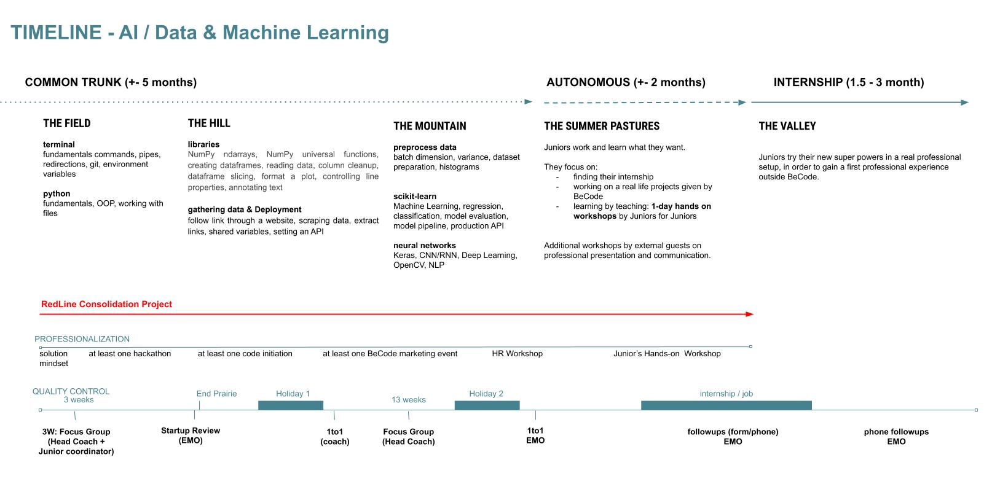

# ATW-Theano-1-21

## Course Overview

The course main purpose is to *bridge the gap* between curious and solution oriented *individuals* and *companies* in need of capable people.The main purpose of this course is to provide the most fundamental knowledge to the students so that they can understand what the AI is. Due to limited time, we will try to eliminate theoretic proofs and formal notations as far as possible, so that the students can get the full picture of AI easily.

Note: The ultimate goal is the mindset, not specific tools. For that reason the timeline above may vary during the course and the tech mentioned might be replaced by others or not seen at all.

| Content | Description |
|---|---|
| [Tech Talks](https://github.com/becodeorg/The-Watch/tree/master/ATW-Theano-1-21)| Small daily talks organised by the learners or coaches on theoretical concepts, interesting related tech, cool findings, etc… |
| Workshops| Interactive session given by the trainees on subject they want to teach their colleagues. |
| Red Line | A growing project during the whole training where the team role-play as a startup facing growing AI problems (consolidation challenges). |
| Case Study |Study of real life cases of AI , well known hacks and advices from professionals.|

| Field |  |
|---|---|
| [Terminal](https://github.com/becodeorg/ATW-Theano-1-21/tree/master/00.Tools)| Introduction to the fundamentals of the command line interface (Unix/Linux) such as navigation, file operation, permissions, package management, text edition, pipes, FIFO, redirections, environment variables and versioning tools like git.|
| [Python](https://github.com/becodeorg/ATW-Theano-1-21/tree/master/01.Python)| Introduction to the language fundamentals in order to be able to execute simple taskes. Understanding the OOP principles and the processes that are required to work with all kinds of files that contain data. |

| Hill |  |
|---|---|
| [Libraries](https://github.com/becodeorg/ANT-Theano-1-21/tree/master/01.Python/02.Python_Libraries)| Get familiar with all the necessary libraries such as NumPy, Pandas and matplotlib so the preprocessing of data can be done with a quick and "clean" way.|
| [Data & Deployment](https://github.com/becodeorg/ANT-Theano-1-21/tree/master/02.%20Deployement)| Work with more specific libraries that are design for gathering/scraping data and store them in databases in order to be able to deploy them using REST API technology.|

| Mountain |  |
|---|---|
| [Machine Learning](https://github.com/becodeorg/ANT-Theano-1-21/tree/master/03.Machine_Learning)| Dealing with data is the most time consuming process, so learning techniques such as cleaning data, histograms, etc, will make the data preparation more accurate. Get familiar with procedures such as regression, classification, model evaluation, etc   |
| [Deep Learning](https://github.com/becodeorg/ANT-Theano-1-21/tree/master/04.Deep_Learning)| Starting with building a simple neural network by scratch and finally interact with Keras and OpenCV, will lead to the result to be able to solve challenges regarding to Deep Learning and NLP.  |

## Requirements

List of minimal requirements for the trainees:

- junior development skills (in any programming language)
- basic math & statistics knowledge 
- fundamental computer know-how (interested in tech, tech savvy)
- problem solver mindset
- motivated
- self-learner

## Course content

BeCode promotes a learning experience based on *projects rather than lessons*.
With that in mind this course content as been divided in multiple categories of
challenges, resources and other tools aiming to teach specific sets of skills.

## Target skills

With an ever-growing and changing set of _things to know_ we made choices so
that, by the end of the training, the learner will have acquired the following
technical foundations and soft skills.

### Tech skills

By the end of the common trunk program, trainees should have acquired a good
*infrastructure affinity*, good *coding background* (with good practices and
secure coding) and the fundamentals of *ΑΙ* and *data science*, allowing them to continue
learning on their own and in the work place.

More specifically:

- Able to de-construct falsehood.
- General knowledge, competences and good practices.
- Able to understand modern tools and techniques.

### Soft skills

- Continuous Learner: Eager to learn, professional learner.
- Team Player: Helps, asks for help, takes its share of the collective load,
	give and takes constructive feedback.
- Reliable: Trustworthy, committed, punctual.
- Change Enthusiast: Flexible, solution mindset.

### Careers
With this training, our learners should be able to pursue the following career paths, to continue learning while acquiring battlefield experience:

- **Data analyst**  : Data analysts are focused on Business development : they sift through data and seek to identify trends. What stories do the numbers tell? What business decisions can be made based on these insights? They may also create visual representations, such as charts and graphs to better showcase what the data reveals.
- **Data Engineer** : Data engineers clean, massage and organize data. They Perform descriptive statistics and analysis to develop insights, build models and solve a business need. 
- **Data Scientist** :  Data Scientists develop, construct, test and maintain architectures, such as databases and large-scale processing systems.
- **Machine Learning Engineer** : The ML Engineer is an expert on using data to training models. The models are then used to automate processes like image classification, speech recognition, and market forecasting.

BeCode helps graduates find an internship, hopefully converting into a job that they like, and at the same time, help partner companies staff up with our autonomous, eager to learn and reliable talents.

